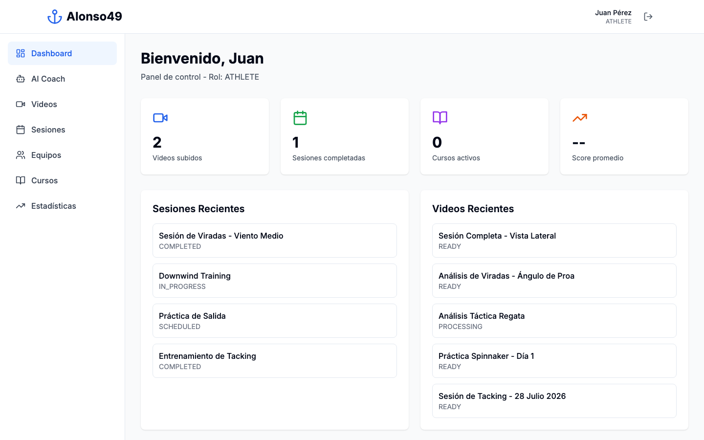
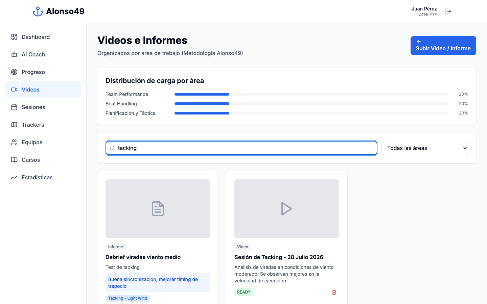
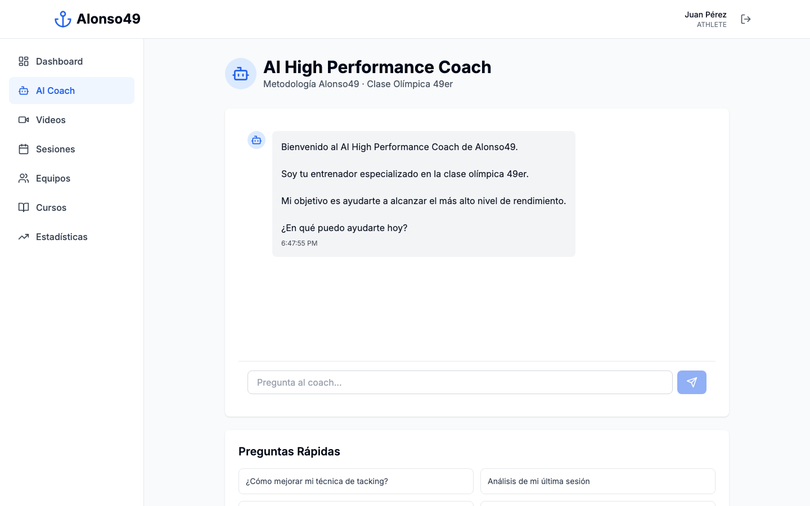
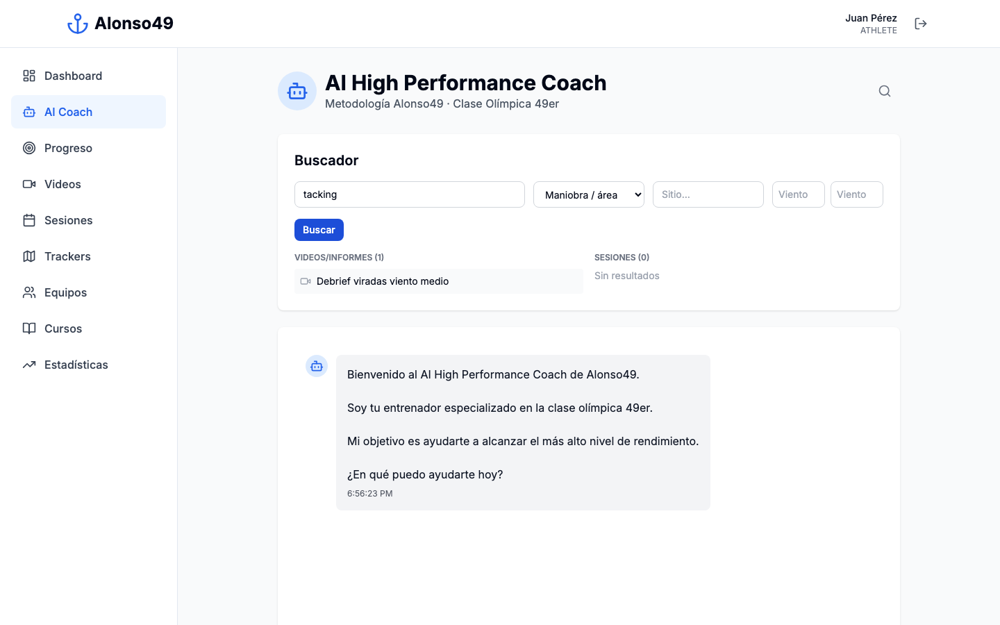
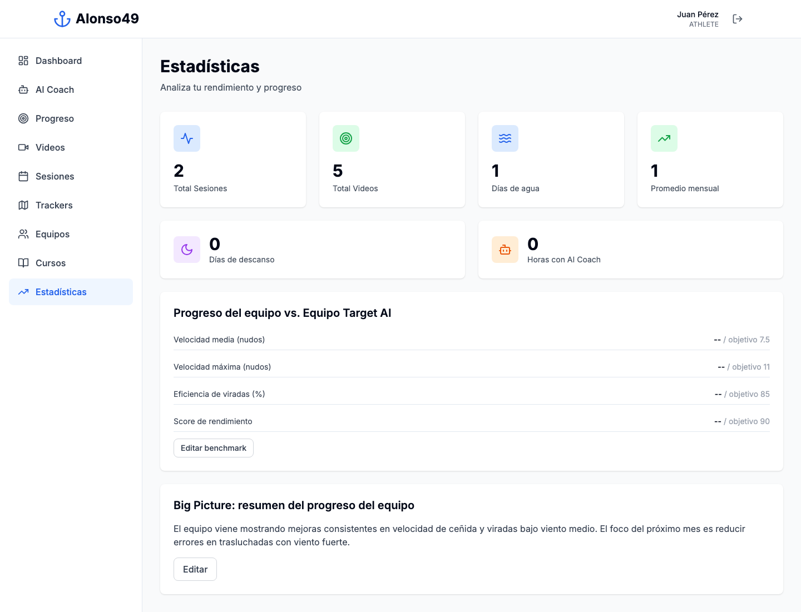
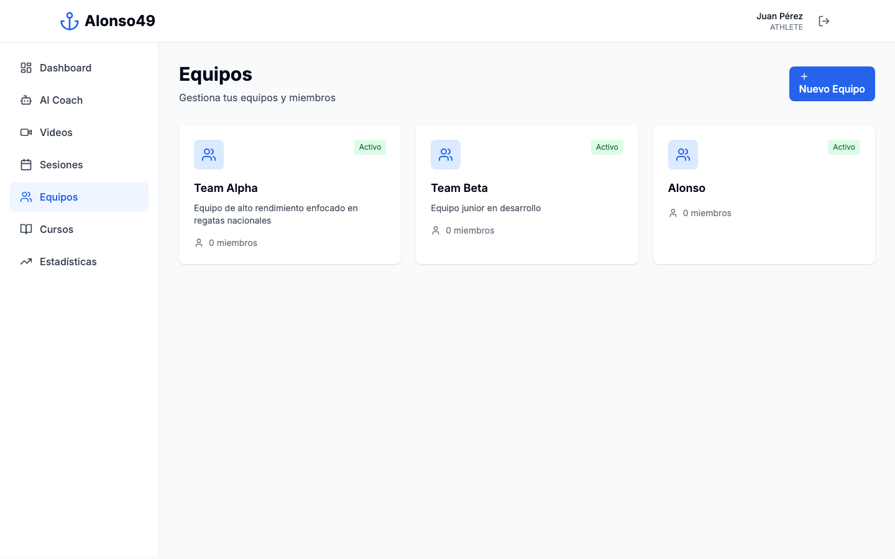
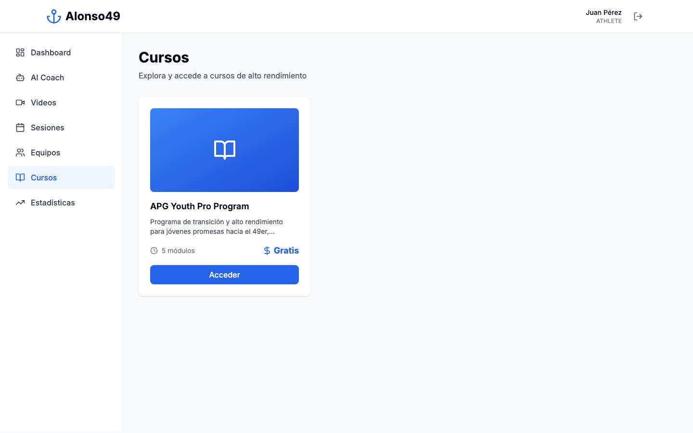
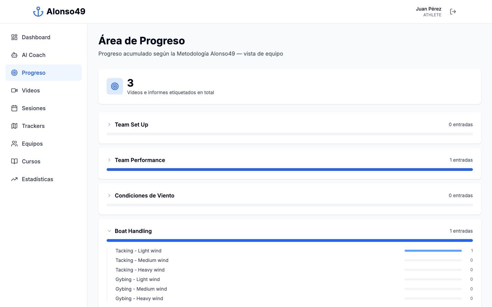
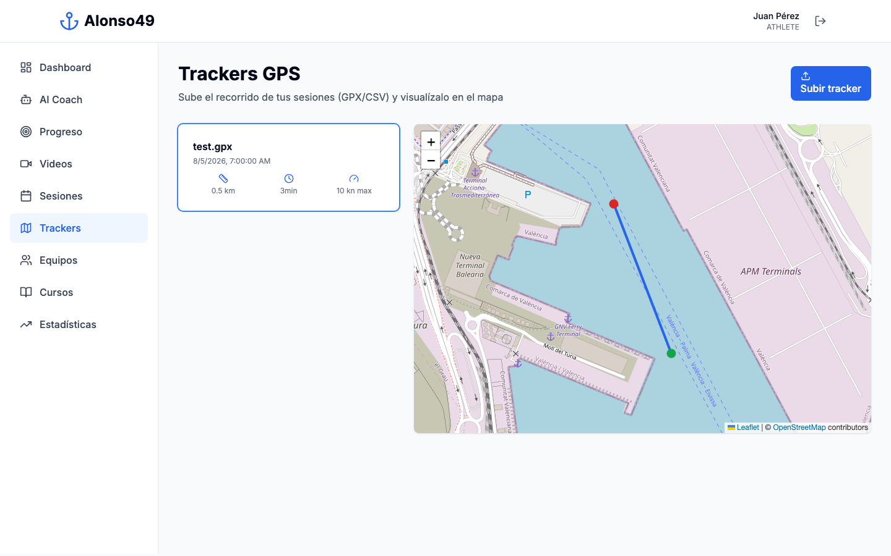

\pagebreak

# Bienvenido a Alonso49 🌊⛵

## ¿Qué es Alonso49?

Alonso49 es tu **plataforma digital de entrenamiento** diseñada específicamente para vela olímpica de clase 49er. Es como tener un entrenador personal disponible las 24 horas del día, que nunca olvida ningún detalle de tu progreso.

Imagina que es tu **diario de entrenamiento inteligente** que:

- Guarda todos tus videos de entrenamiento
- Analiza tu rendimiento
- Te da consejos personalizados
- Te ayuda a planificar tus sesiones
- Te conecta con tu entrenador
- Te muestra tu evolución con el tiempo


\pagebreak

# ¿Para Quién es Esta Plataforma?

## 👤 Tipos de Usuarios

Alonso49 está diseñado para **cuatro tipos de personas** diferentes, cada una con sus propias necesidades:

### 1. 🏃‍♂️ Atleta (Tú como Regatista)

**¿Qué puedes hacer?**

- Subir videos de tus entrenamientos
- Crear un registro de cada sesión de entrenamiento
- Ver tus estadísticas y progreso
- Recibir feedback de tu entrenador
- Hablar con un "Entrenador Virtual" que te da consejos
- Revisar tus objetivos y metas

**Piensa en ti como:** El protagonista de tu historia deportiva. La plataforma guarda cada capítulo de tu progreso.

---

### 2. 👨‍🏫 Entrenador (Coach)

**¿Qué puede hacer tu entrenador?**

- Ver todos tus entrenamientos
- Revisar tus videos
- Dejarte comentarios y consejos
- Crear planes de entrenamiento para ti
- Seguir tu progreso
- Gestionar un equipo completo

**Piensa en tu coach como:** Tu director técnico que usa la plataforma para tener todos tus datos organizados en un solo lugar.

---

### 3. 🏢 Academia

**¿Qué puede hacer una academia?**

- Gestionar varios equipos al mismo tiempo
- Administrar múltiples entrenadores
- Crear cursos de vela para vender
- Ver estadísticas de todos sus atletas
- Generar reportes de rendimiento

**Piensa en la academia como:** La organización que dirige toda la operación deportiva.

---

### 4. ⚙️ Administrador

**¿Qué hace el administrador?**

- Gestiona todos los usuarios de la plataforma
- Configura el sistema
- Revisa que todo funcione correctamente
- Da permisos especiales

**Piensa en el administrador como:** El responsable técnico que mantiene todo funcionando.

\pagebreak

# Cómo Funciona la Plataforma - Paso a Paso

## 🚀 Primeros Pasos

### 1. Crear tu Cuenta

**Es tan fácil como crear una cuenta de email:**

1. Ve a la página de Alonso49
2. Haz clic en "Registrarse"
3. Completa tus datos:
   - Nombre
   - Email
   - Contraseña
   - Tu rol (Atleta, Coach, etc.)
4. ¡Listo! Ya tienes acceso

**Nota importante:** Tu entrenador o academia puede crearte la cuenta directamente.

---

### 2. Iniciar Sesión

Cada vez que quieras entrar:

1. Ve a la página principal
2. Ingresa tu email y contraseña
3. Haz clic en "Entrar"
4. Llegarás a tu **Panel Principal** (Dashboard)


\pagebreak

# Tu Panel Principal (Dashboard) 📊

## ¿Qué Verás al Entrar?

Tu panel principal es como el **tablero de control de un auto deportivo**. Te muestra todo lo importante de un vistazo:

### 📈 Resumen de tu Actividad
- Número de entrenamientos esta semana
- Tiempo total entrenado
- Videos subidos
- Mensajes de tu entrenador

### 🎯 Tus Objetivos
- Metas que te has propuesto
- Progreso hacia esas metas
- Próximas competiciones

### 📅 Calendario
- Sesiones programadas
- Entrenamientos completados
- Eventos importantes

### 💬 Notificaciones
- Nuevos comentarios de tu coach
- Recordatorios de entrenamientos
- Actualizaciones importantes



\pagebreak

# Funcionalidades Principales

## 1. 📹 Videos e Informes

### ¿Por Qué Subir Videos (o Informes)?

Los videos son **la memoria visual de tu entrenamiento**. Es como tener una cámara GoPro que registra todo tu progreso.

A veces no tenés un video, pero sí querés dejar constancia de algo que trabajaste (un debrief, un análisis táctico, una nota del entrenador). Para eso existe el **Informe**: el mismo tipo de registro, pero sin archivo de video, solo texto.

**Beneficios:**

- Ver tus errores y aciertos
- Comparar cómo eras antes vs ahora
- Tu entrenador puede analizarlos en detalle
- La plataforma los organiza y los busca por vos

### ¿Cómo Subir un Video o Informe?

**Paso a Paso:**

1. En tu panel, haz clic en **"Videos"**
2. Presiona el botón **"Subir Video / Informe"**
3. Elegí el tipo: **Video** (con URL) o **Informe** (solo texto)
4. Agregá información útil:
   - **Título:** Ejemplo: "Entrenamiento maniobras - 15 nudos"
   - **Descripción:** Qué estabas practicando
   - **Feedback:** Qué estuvo bien y qué es mejorable
   - **Áreas / etiquetas:** una o más secciones y subsecciones de la Metodología Alonso49 (ver [Área de Progreso](#8-área-de-progreso))
5. Haz clic en **"Subir"**

**¡Listo!** Cada video o informe etiquetado alimenta automáticamente tu Área de Progreso.

### Distribución de Carga por Área

Arriba de la lista vas a ver una barra por cada sección de la metodología, con el **porcentaje de tu contenido subido** que corresponde a cada área. Te ayuda a ver de un vistazo si estás dejando alguna área sin trabajar (por ejemplo, si el 80% de tus videos son de Boat Speed y ninguno de Táctica).


### Buscar Videos e Informes

Arriba de la lista hay un **buscador con filtros**: texto libre (busca en título, descripción y feedback) y un desplegable de área/subsección de la metodología. Los resultados se filtran al instante.



---

## 2. 📝 Crear Sesiones de Entrenamiento

### ¿Qué es una Sesión?

Una sesión es como una **página de tu diario de entrenamiento**. Registras:

- Qué hiciste
- Cómo te sentiste
- Qué aprendiste
- Qué quieres mejorar

### ¿Cómo Crear una Sesión?

**Paso a Paso:**

1. Ve a **"Sesiones"** en el menú
2. Haz clic en **"Nueva Sesión"**
3. Completa la información:

#### A) Información Básica
- **Fecha y hora:** Cuándo entrenaste
- **Duración:** Cuánto tiempo (ejemplo: 2 horas)
- **Ubicación:** Dónde entrenaste
- **Condiciones:** Viento, temperatura, olas

#### B) Tipo de Sesión
Selecciona qué tipo fue:

- 🏋️ **Entrenamiento:** Práctica normal
- 🏆 **Competición:** Una regata
- 💪 **Físico:** Gimnasio o preparación física
- 🧘 **Recuperación:** Día de descanso activo
- 🎯 **Técnica:** Enfocado en mejorar algo específico

#### C) Objetivos
¿Qué querías lograr?

- Ejemplo: "Mejorar velocidad en ceñida"
- Ejemplo: "Practicar salidas limpias"

#### D) Descripción
Cuenta qué hiciste:

- Ejercicios realizados
- Cómo salió
- Qué funcionó y qué no

#### E) Videos
Puedes adjuntar videos de esa sesión

4. Haz clic en **"Guardar Sesión"**

### Ver tus Sesiones

Todas tus sesiones quedan guardadas en un **historial ordenado por fecha**. Puedes:

- Filtrar por tipo
- Buscar por fecha
- Ver estadísticas globales


---

## 3. 🤖 Tu Entrenador Virtual con IA

### ¿Qué es el AI High Performance Coach?

Es como tener un **entrenador experto disponible 24/7** que conoce TODO sobre ti:

- Todos tus entrenamientos
- Tus videos
- Tu progreso
- Tus objetivos
- Tu historial completo

**No es un chatbot común.** Es un sistema inteligente que realmente entiende de vela y de tu rendimiento.



### 🔍 El Buscador (la lupa)

Arriba a la derecha del chat hay un ícono de **lupa**. Al abrirlo aparece un buscador con filtros para encontrar rápido lo que necesitás, sin tener que escribirle al coach:

- **Texto libre:** busca en títulos, descripciones y feedback
- **Maniobra / área:** cualquier sección o subsección de la Metodología Alonso49 (por ejemplo, "Tacking - Light wind")
- **Sitio:** dónde entrenaste
- **Viento (mín/máx):** rango de nudos

Los resultados se muestran divididos en **Videos/Informes** y **Sesiones** que coinciden con lo que buscaste.



### ¿Qué Puedes Preguntarle?

**Ejemplos de Preguntas:**

#### Sobre tu Rendimiento
- "¿Cómo ha sido mi progreso este mes?"
- "¿En qué debo enfocarme para mejorar?"
- "¿Cuáles son mis puntos débiles?"

#### Análisis de Técnica
- "Revisa mi video del último entrenamiento"
- "¿Qué puedo mejorar en mis maniobras?"
- "Dame consejos para navegar con viento flojo"

#### Planificación
- "Crea un plan de entrenamiento para esta semana"
- "Qué ejercicios me recomiendas para mejorar velocidad"
- "Sugiéreme objetivos realistas para el próximo mes"

#### Comparación
- "Compara mi sesión de hoy con la de la semana pasada"
- "¿He mejorado en salidas desde enero?"

#### Estrategia
- "Dame consejos para regatear con olas grandes"
- "¿Cómo debo prepararme mentalmente para la competición?"

### ¿Cómo Usar el AI Coach?

**Paso a Paso:**

1. Ve a **"AI Coach"** en el menú
2. Escribe tu pregunta en lenguaje natural (como hablarías con un amigo)
3. Presiona Enter o haz clic en **"Enviar"**
4. El AI Coach analiza tus datos y te responde con:
   - Análisis detallado
   - Recomendaciones específicas
   - Referencias a tus sesiones o videos
   - Planes de acción concretos

**Ejemplo de Conversación:**

```
Tú: "¿Cómo puedo mejorar mi velocidad en ceñida?"

AI Coach: 
"Basándome en tus últimas 5 sesiones, he notado que:

1. Tu velocidad promedio en ceñida es 6.2 nudos
2. Tus mejores sesiones fueron con viento entre 12-15 nudos
3. En condiciones de viento flojo (8-10 nudos) pierdes velocidad

Recomendaciones:
- Trabaja en tu sensibilidad al viento flojo
- Revisa el video de tu sesión del 25/07 donde lograste 6.8 nudos
- Ejercicio sugerido: Práctica de sensibilidad de timón con viento 8-10 nudos

¿Quieres que te cree un plan de entrenamiento específico?"

Tú: "Sí, créame un plan para esta semana"

AI Coach:
"Plan de entrenamiento - Semana del 5 al 11 de Agosto:

Lunes: Técnica de ceñida con viento flojo (2h)
Miércoles: Trabajo físico + sensibilidad de timón (1.5h)
Viernes: Sesión completa de ceñidas con análisis de video (2h)
Sábado: Regata simulada con enfoque en salidas (3h)

Te enviaré recordatorios cada día. ¿Quieres más detalles de alguna sesión?"
```

### Las 20 Herramientas del AI Coach

El AI Coach puede hacer 20 cosas diferentes por ti:

#### 🔍 Herramientas de Consulta (Para obtener información)

1. **Ver tu Perfil Completo**
   - Toda tu información personal y deportiva
   
2. **Ver tus Sesiones Recientes**
   - Tus últimos entrenamientos
   
3. **Detalles de una Sesión**
   - Análisis profundo de un entrenamiento específico
   
4. **Ver tus Videos**
   - Acceso a tu galería completa
   
5. **Buscar Videos**
   - Encontrar videos por descripción o contenido
   
6. **Ver tu Rendimiento**
   - Estadísticas y métricas de progreso
   
7. **Información de tu Equipo**
   - Datos de tus compañeros de equipo
   
8. **Ver tu Plan de Entrenamiento**
   - Tu programa actual

#### ⚡ Herramientas de Acción (Para crear y modificar)

9. **Crear Plan de Sesión**
   - Planificar tu próximo entrenamiento
   
10. **Agregar Feedback a Sesión**
    - Registrar comentarios sobre tu entrenamiento
    
11. **Sugerir Ejercicios**
    - Recomendarte ejercicios específicos
    
12. **Analizar Técnica**
    - Revisar tus videos y darte consejos técnicos
    
13. **Crear Programa de Entrenamiento**
    - Planificar varias semanas adelante
    
14. **Establecer Objetivos**
    - Definir metas realistas y medibles
    
15. **Recomendar Videos**
    - Sugerirte videos útiles de tu archivo
    
16. **Generar Reporte**
    - Crear un informe de tu rendimiento

#### 🎯 Herramientas Especializadas

17. **Análisis de Condiciones Meteorológicas**
    - Cómo el clima afecta tu rendimiento
    
18. **Comparar Sesiones**
    - Ver diferencias entre entrenamientos
    
19. **Predecir Rendimiento**
    - Proyectar tu evolución futura
    
20. **Coaching Mental**
    - Ayudarte con la preparación psicológica

---

## 4. 📊 Analytics y Estadísticas

### Ver tu Progreso en Números

La plataforma convierte tus entrenamientos en **estadísticas reales**, calculadas automáticamente a partir de tus sesiones, videos y uso del AI Coach.

### ¿Qué Puedes Ver?

#### 🎯 Métricas Personales
- **Días de agua:** cuántos días distintos navegaste (sesiones completadas)
- **Promedio mensual:** tu ritmo de días de agua por mes
- **Días de descanso:** días sin navegar dentro de tu período activo de entrenamiento
- **Horas con AI Coach:** tiempo total que pasaste conversando con tu entrenador virtual

#### 🏆 Progreso del Equipo vs. Equipo Target AI
Si pertenecés a un equipo, vas a ver una comparación directa entre el **rendimiento real** del equipo (velocidad media, velocidad máxima, eficiencia de viradas, score de rendimiento) y un **benchmark objetivo** que tu coach o academia configura. Así queda claro, de un vistazo, en qué está el equipo respecto a la meta.

#### 📝 Big Picture
Un resumen cualitativo, editable por el coach o el atleta, con el análisis general del progreso del equipo a la fecha: qué está funcionando y en qué hay que enfocarse.



---

## 5. 💬 Comunicación con tu Entrenador

### Sistema de Feedback

Tu entrenador puede dejarte **comentarios en cada sesión**. Es como tener notas adhesivas digitales con consejos.

### Tipos de Feedback que Recibirás

#### 1. Feedback Técnico
Sobre tu forma de navegar:

- "Excelente control del timón en las ráfagas"
- "Necesitas mejorar la sincronización en la maniobra"

#### 2. Feedback Táctico
Sobre tus decisiones en el agua:

- "Buena lectura del campo de regata"
- "Trabaja en la elección de lado de campo"

#### 3. Feedback Físico
Sobre tu condición física:

- "Mantén el trabajo de fuerza"
- "Aumenta resistencia cardiovascular"

#### 4. Feedback Mental
Sobre tu actitud y mentalidad:

- "Excelente actitud positiva"
- "Trabaja en concentración bajo presión"

### Notificaciones

Cuando tu coach te deja feedback, recibes una **notificación** para que no te pierdas nada.

---

## 6. 👥 Equipos y Compañeros

### ¿Qué es un Equipo?

Un equipo en Alonso49 es tu **grupo de entrenamiento**. Puede ser:

- Tu academia completa
- Un grupo de regatistas que entrenan juntos
- Compañeros de competición

### ¿Qué Puedes Hacer en Equipo?

#### Ver Estadísticas Grupales
- Rendimiento del equipo completo
- Compararte con tus compañeros (de forma sana)
- Objetivos grupales

#### Entrenamientos Compartidos
- Ver sesiones grupales
- Comentar entrenamientos de compañeros
- Compartir videos y consejos

#### Competencia Amistosa
- Rankings internos
- Tablas de logros
- Motivación colectiva



---

## 7. 🎓 Cursos y Formación

### ¿Qué Son los Cursos?

Tu academia o entrenador puede crear **cursos educativos** dentro de la plataforma.

**Ejemplos de cursos:**

- "Fundamentos de Vela 49er"
- "Técnicas Avanzadas de Ceñida"
- "Preparación Mental para Competiciones"
- "Meteorología para Regatistas"

### Estructura de un Curso

Cada curso tiene:

#### 📚 Módulos
Temas organizados en lecciones:

- Módulo 1: Introducción
- Módulo 2: Técnicas Básicas
- Módulo 3: Práctica
- Módulo 4: Evaluación

#### 📹 Contenido Multimedia
- Videos explicativos
- Documentos PDF
- Imágenes y diagramas
- Tests de conocimiento

#### 🎯 Progreso
- Seguimiento de qué has completado
- Certificados al terminar
- Evaluaciones de aprendizaje

### ¿Cómo Tomar un Curso?

1. Ve a **"Cursos"**
2. Explora los cursos disponibles
3. Haz clic en **"Inscribirse"** en el que te interese
4. Avanza a tu propio ritmo
5. Completa los módulos
6. ¡Obtén tu certificado!



---

## 8. 🎯 Área de Progreso

### ¿Qué es el Área de Progreso?

Es el corazón de la Metodología Alonso49 dentro de la plataforma: una vista que organiza **todo tu contenido etiquetado** (videos e informes) según las 6 áreas de trabajo de la metodología, cada una con sus subsecciones.

**Las 6 áreas:**

1. **Team Set Up** — trimado de mástil y vela, preparación del barco, elección de material
2. **Team Performance** — comunicación, boat speed, body language, VMG
3. **Condiciones de Viento** — light / medium / strong wind
4. **Boat Handling** — tacking y gybing, en cada rango de viento
5. **Mark Rounding** — eights, inverted triangle, 3 laps, racing mode
6. **Planificación y Táctica** — pre-start, táctica y estrategia (upwind/downwind), análisis del tipo de día

### ¿Cómo Funciona?

Cada vez que subís un video o un informe y lo etiquetás con una o más de estas áreas (ver [Videos e Informes](#1-videos-e-informes)), esa entrada suma al contador de progreso de esa sección. La pantalla de Progreso te muestra, para cada área, **cuántas entradas acumulaste**, con una barra proporcional para comparar de un vistazo dónde estás poniendo más foco.

Hacé clic en cualquier sección para desplegar sus subsecciones y ver el detalle.

**Vista individual o de equipo:** si pertenecés a un equipo, el progreso se calcula sumando el contenido de todo el equipo; si no, se calcula solo con tu propio contenido.



---

## 9. 🗺️ Trackers GPS y Mapas

### ¿Qué es un Tracker?

Es el recorrido que hizo tu barco en el agua durante una sesión, capturado por un GPS o un dispositivo como Vakaros. Subiendo ese archivo, la plataforma dibuja el recorrido real sobre un mapa.

### ¿Cómo Subir un Tracker?

**Paso a Paso:**

1. Ve a **"Trackers"** en el menú
2. Hacé clic en **"Subir tracker"**
3. Elegí el archivo exportado por tu GPS o dispositivo (formato **GPX** o **CSV** con columnas de latitud/longitud/hora)
4. La plataforma calcula automáticamente:
   - Distancia recorrida
   - Duración
   - Velocidad promedio y máxima
5. El recorrido queda disponible para visualizar en el mapa

### Ver el Recorrido en el Mapa

Al seleccionar un tracker de la lista, se dibuja el recorrido sobre un mapa real: el punto **verde** marca el inicio y el **rojo** el final.



\pagebreak

# Metodología Alonso49: El Ciclo Cerrado

## ¿Qué es el "Ciclo Cerrado de Coaching"?

Es la **filosofía de entrenamiento** que usa esta plataforma. Se llama "cerrado" porque es un círculo continuo de mejora.

## Los 5 Pasos del Ciclo

### 1️⃣ Planificar 📋
**¿Qué vamos a hacer?**

- Definir objetivos de la sesión
- Elegir ejercicios específicos
- Establecer metas medibles

**Ejemplo:**
"Hoy voy a practicar salidas en línea por 2 horas. Meta: 10 salidas limpias."

---

### 2️⃣ Ejecutar ⛵
**¡Manos a la obra!**

- Realizar el entrenamiento
- Grabar videos
- Tomar notas mentales

**Ejemplo:**
Sales al agua, practicas tus salidas, grabas algunas con la GoPro.

---

### 3️⃣ Analizar 🔍
**¿Qué pasó?**

- Revisar el entrenamiento
- Ver los videos
- Identificar aciertos y errores

**Ejemplo:**
"De 10 salidas, 7 fueron buenas. En 3 llegué tarde a la línea."

---

### 4️⃣ Retroalimentar 💬
**Recibir consejos**

- Tu coach revisa tu sesión
- El AI Coach analiza tus datos
- Obtienes feedback específico

**Ejemplo:**
Tu coach te escribe: "Excelente mejora en timing. Trabaja en acelerar 5 segundos antes."

---

### 5️⃣ Ajustar 🎯
**Mejorar para la próxima**

- Aplicar lo aprendido
- Modificar la estrategia
- Establecer nuevo plan

**Ejemplo:**
En tu próximo entrenamiento, te enfocas en acelerar más temprano.

---

## El Círculo Continuo

```
    📋 PLANIFICAR
         ↓
    ⛵ EJECUTAR
         ↓
    🔍 ANALIZAR
         ↓
    💬 RETROALIMENTAR
         ↓
    🎯 AJUSTAR
         ↓
    📋 PLANIFICAR (de nuevo)
    
    ... y así sucesivamente
```

**Cada ciclo te hace mejor que el anterior.**

\pagebreak

# Casos de Uso Prácticos

## Caso 1: Un Día Típico de Entrenamiento

### Mañana - Antes de Entrenar

**8:00 AM - Revisas la plataforma**

- Ves tu plan de entrenamiento del día
- Lees los comentarios de tu coach
- Revisas tus objetivos de la semana

**8:30 AM - Consultas al AI Coach**
```
Tú: "¿Qué debo enfocarme hoy?"

AI Coach: "Según tu plan, hoy trabajarás ceñidas con viento moderado.
Objetivos:
1. Mantener velocidad constante
2. Practicar sensibilidad de timón
3. Grabar al menos 2 bordos para análisis

El pronóstico indica 12-14 nudos, perfecto para tu objetivo."
```

### Mediodía - Durante el Entrenamiento

**12:00 PM - En el agua**

- Tienes tu GoPro grabando
- Te concentras en tus objetivos
- Mentalmente registras lo que funciona

### Tarde - Después de Entrenar

**3:00 PM - Registras tu sesión**

1. Vas a "Nueva Sesión"
2. Completas la información:
   - Duración: 2.5 horas
   - Tipo: Entrenamiento técnico
   - Condiciones: Viento 13 nudos, oleaje moderado
   - Descripción: "Práctica de ceñida. Trabajé sensibilidad de timón."

3. Subes tu video de la GoPro
4. Guardas la sesión

**4:00 PM - Consultas al AI Coach**

```
Tú: "Analiza mi sesión de hoy"

AI Coach: "He revisado tu sesión y video:

✅ Puntos Positivos:
- Buena velocidad promedio: 6.4 nudos
- Control de timón mejorado 20% vs semana pasada
- Excelente posición corporal en ráfagas

⚠️ Áreas de Mejora:
- Timing en cambio de bordos puede ser más rápido
- En 2 ocasiones perdiste velocidad innecesariamente

📊 Comparativa:
Hoy vs Última Sesión Similar: +12% en velocidad

🎯 Recomendación:
Tu próxima sesión enfócate en transiciones rápidas entre bordos.
¿Quieres que te sugiera ejercicios específicos?"
```

**5:00 PM - Tu coach deja feedback**

Recibes notificación:
"Nuevo comentario de Coach Miguel"

```
"Excelente sesión, veo mucha mejora en tu técnica.
El video muestra que tus movimientos son más fluidos.
Para mañana: trabaja en salidas. Te preparé un plan.
¡Sigue así!"
```

---

## Caso 2: Preparación para una Competición

### 4 Semanas Antes

**Estableces objetivos con el AI Coach**

```
Tú: "Tengo una regata importante en 4 semanas. ¿Qué debo hacer?"

AI Coach: "Perfecto, creemos un plan de preparación:

SEMANA 1: Base Técnica
- 4 sesiones de técnica fundamental
- 2 sesiones de condición física
- Objetivo: Reforzar fundamentos

SEMANA 2: Intensificación
- 3 sesiones técnicas intensivas
- 2 regatas de práctica
- 1 sesión de análisis de video
- Objetivo: Aumentar exigencia

SEMANA 3: Competición Simulada
- 4 regatas simuladas
- Análisis detallado de cada regata
- Trabajo mental
- Objetivo: Preparación táctica

SEMANA 4: Afinación
- 2 sesiones técnicas ligeras
- 1 regata de práctica
- Descanso activo
- Objetivo: Llegar fresco

¿Quieres que te cree las sesiones detalladas?"
```

### Durante las 4 Semanas

- Sigues el plan
- Registras cada sesión
- Recibes feedback continuo
- Ajustas según el progreso

### Semana de la Competición

**AI Coach te da consejos específicos:**

```
"Análisis pre-competición:

📊 Tu rendimiento actual:
- Velocidad: +18% vs hace 4 semanas
- Consistencia: Excelente
- Preparación táctica: Muy buena
- Estado mental: Positivo

🎯 Puntos fuertes para aprovechar:
- Tus salidas están en el mejor momento
- Excelente lectura de viento
- Buena velocidad en todas las condiciones

⚠️ Ten cuidado con:
- Tendencia a ser agresivo en exceso
- Mantén calma en maniobras cerradas

💪 Recomendaciones finales:
1. Descansa bien los 2 días previos
2. Visualiza tus regatas ideales
3. Confía en tu preparación
4. Disfruta la competición

¡Estás listo! 🏆"
```

---

## Caso 3: Análisis de Progreso Mensual

### Cada Mes

**Revisas tu evolución completa:**

1. **Vas a Analytics**
2. **Seleccionas "Reporte Mensual"**
3. **Ves tu progreso en gráficas:**

```
JULIO 2026 - REPORTE MENSUAL

📊 RESUMEN GENERAL
━━━━━━━━━━━━━━━━━━━━
Sesiones completadas: 22
Tiempo total: 48 horas
Videos analizados: 18
Días de entrenamiento: 18 de 31

📈 EVOLUCIÓN
━━━━━━━━━━━━━━━━━━━━
Velocidad promedio:
  Junio: 6.1 nudos
  Julio: 6.5 nudos
  Mejora: +6.5% ✅

Consistencia:
  Junio: 75%
  Julio: 88%
  Mejora: +13% ✅

🎯 OBJETIVOS
━━━━━━━━━━━━━━━━━━━━
✅ Mejorar salidas: 90% logrado
✅ Aumentar velocidad: 85% logrado
⏳ Técnica de maniobras: 70% logrado

💬 FEEDBACK RECIBIDO
━━━━━━━━━━━━━━━━━━━━
Total comentarios: 15
Aspectos positivos: 12
Áreas de mejora: 8

🔮 PROYECCIÓN AGOSTO
━━━━━━━━━━━━━━━━━━━━
Si mantienes este ritmo:
- Velocidad estimada: 6.7 nudos
- Preparado para competición nivel regional
```

4. **Compartes el reporte con tu coach**
5. **Juntos establecen objetivos para agosto**

\pagebreak

# Preguntas Frecuentes (FAQ)

## ❓ Sobre Uso General

### ¿Necesito internet para usar la plataforma?
**Sí**, Alonso49 funciona en la nube, necesitas conexión a internet. Pero puedes subir videos más tarde si grabas sin conexión.

### ¿Puedo usar Alonso49 desde mi teléfono?
**Sí**, la plataforma funciona en:

- 💻 Computadoras (Mac, Windows, Linux)
- 📱 Teléfonos móviles (iPhone, Android)
- 📲 Tablets (iPad, tablets Android)

### ¿Qué pasa si olvido mi contraseña?
1. Haz clic en "¿Olvidaste tu contraseña?"
2. Ingresa tu email
3. Recibirás un enlace para crear una nueva
4. Sigue las instrucciones

### ¿Puedo cambiar mi información personal?
**Sí**, ve a tu perfil y haz clic en "Editar". Puedes cambiar:

- Foto de perfil
- Información personal
- Contraseña
- Preferencias

---

## ❓ Sobre Videos

### ¿Qué tamaño pueden tener mis videos?
Los videos pueden ser de cualquier tamaño razonable. La plataforma los procesa automáticamente para que carguen rápido.

### ¿Qué formatos de video puedo subir?
Soportamos los formatos más comunes:

- MP4
- MOV
- AVI
- MKV
- GoPro nativos

### ¿Cuántos videos puedo subir?
**Ilimitados**. No hay límite de videos o espacio de almacenamiento.

### ¿Puedo descargar mis videos después de subirlos?
**Sí**, siempre puedes descargar tus propios videos.

### ¿Puedo eliminar un video?
**Sí**, puedes eliminar videos que ya no quieras. Pero ten cuidado, no se pueden recuperar.

### ¿Qué es un "Informe" y en qué se diferencia de un video?
Es el mismo tipo de registro que un video, pero sin archivo adjunto: solo título, descripción, feedback y etiquetas. Sirve para dejar constancia de un análisis o debrief cuando no tenés una grabación.

### ¿Cómo se calcula el "% de carga" por área?
Es el porcentaje de tus videos e informes que están etiquetados en cada sección de la metodología, sobre el total de contenido subido. Te ayuda a detectar si estás descuidando alguna área.

---

## ❓ Sobre el Área de Progreso y Trackers

### ¿Necesito etiquetar todos mis videos para que sirva el Área de Progreso?
Solo los que quieras que cuenten. Un video sin etiquetas no suma a ninguna sección, pero sigue estando disponible en tu galería y en el buscador.

### ¿Qué formatos de tracker GPS puedo subir?
Archivos **GPX** (el estándar de la mayoría de los GPS y relojes deportivos) o **CSV** con columnas de latitud, longitud y hora.

### ¿Puedo vincular un tracker a una sesión específica?
Sí, si el tracker corresponde a una sesión ya creada, quedan relacionados y podés consultarlos juntos.

---

## ❓ Sobre Sesiones

### ¿Puedo editar una sesión después de crearla?
**Sí**, puedes editar sesiones en cualquier momento para agregar o corregir información.

### ¿Puedo borrar una sesión?
**Sí**, pero solo tú o tu coach pueden hacerlo.

### ¿Mi coach ve todas mis sesiones?
**Sí**, tu coach puede ver todas tus sesiones para darte mejor feedback.

---

## ❓ Sobre el AI Coach

### ¿El AI Coach reemplaza a mi entrenador humano?
**No**, el AI Coach es un **complemento**. Tu entrenador humano sigue siendo esencial. El AI Coach te ayuda cuando tu entrenador no está disponible.

### ¿Puedo preguntarle cualquier cosa al AI Coach?
Puedes preguntarle sobre:

- Tu entrenamiento y rendimiento
- Consejos técnicos de vela
- Planificación de sesiones
- Análisis de progreso

No puede responder preguntas que no tengan relación con vela o entrenamiento.

### ¿El AI Coach aprende de mí?
**Sí**, mientras más uses la plataforma, mejor te conoce y más personalizadas son sus recomendaciones.

### ¿Puedo confiar en los consejos del AI Coach?
El AI Coach está entrenado con conocimiento experto de vela olímpica, pero siempre consulta cosas importantes con tu entrenador humano.

---

## ❓ Sobre Seguridad y Privacidad

### ¿Mis datos están seguros?
**Sí**, usamos:

- Encriptación de datos
- Servidores seguros
- Backups automáticos
- Protocolos de seguridad profesionales

### ¿Quién puede ver mis videos y sesiones?
Solo pueden ver tus datos:

- **Tú**
- **Tu entrenador**
- **Administradores de tu academia** (si estás en una)
- **Administradores del sistema** (solo para soporte técnico)

Nadie más tiene acceso.

### ¿Puedo hacer privadas algunas sesiones?
**Sí**, puedes marcar sesiones como "Privadas" y solo tú las verás.

### ¿Puedo exportar todos mis datos?
**Sí**, en cualquier momento puedes descargar todos tus datos en un archivo.

---

## ❓ Sobre Problemas Técnicos

### ¿Qué hago si un video no se sube?
1. Verifica tu conexión a internet
2. Intenta con un navegador diferente
3. Comprueba el formato del video
4. Si persiste, contacta soporte

### ¿Qué hago si la página carga lenta?
1. Verifica tu conexión a internet
2. Cierra otras pestañas del navegador
3. Limpia la caché del navegador
4. Intenta en otro dispositivo

### ¿A quién contacto si tengo un problema?
- 📧 Email de soporte: [soporte@alonso49.com]
- 💬 Chat en vivo dentro de la plataforma
- 📞 Teléfono de soporte: [número]

---

## ❓ Sobre Costos y Planes

### ¿Cuánto cuesta Alonso49?
El costo depende de tu rol:

- **Atletas:** Generalmente incluido por tu academia o coach
- **Coaches:** Plan mensual o anual
- **Academias:** Plan personalizado según tamaño

Contacta a ventas para información específica.

### ¿Hay periodo de prueba gratis?
**Sí**, ofrecemos 30 días de prueba gratuita.

### ¿Puedo cancelar en cualquier momento?
**Sí**, puedes cancelar tu suscripción cuando quieras. Mantendrás acceso hasta el final del periodo pagado.

\pagebreak

# Consejos y Mejores Prácticas

## 🎯 Para Aprovechar al Máximo la Plataforma

### 1. Sé Consistente
**Usa la plataforma todos los días** aunque sea 5 minutos:

- Registra cada entrenamiento
- Revisa tu progreso
- Lee el feedback de tu coach

La magia está en la **constancia**, no en sesiones esporádicas intensas.

---

### 2. Sé Honesto en tus Registros
**No embellezas tus sesiones**:

- Si fue un mal día, regístralo
- Anota tus errores
- Sé sincero con tus sensaciones

Solo con honestidad puedes mejorar de verdad.

---

### 3. Usa el AI Coach Frecuentemente
**No tengas miedo de hacer preguntas**:

- Pregunta sobre cualquier duda
- Pide análisis después de cada sesión
- Solicita consejos específicos

El AI Coach está ahí para ti 24/7.

---

### 4. Sube Videos Regularmente
**Los videos son oro**:

- Graba tus entrenamientos
- Súbelos el mismo día si puedes
- Agrégales buenas descripciones

Un video vale más que mil palabras.

---

### 5. Revisa tus Analytics Semanalmente
**Dedica 15 minutos cada domingo**:

- Revisa tu semana
- Compara con tus objetivos
- Ajusta tu plan si es necesario

El que mide, mejora.

---

### 6. Comunícate con tu Coach
**Aprovecha el feedback**:

- Lee todos los comentarios
- Haz preguntas
- Pide aclaraciones

Tu coach quiere ayudarte, facilítale el trabajo.

---

### 7. Establece Objetivos SMART

**Objetivos buenos vs malos:**

❌ **Malo:** "Quiero mejorar en vela"
✅ **Bueno:** "Quiero aumentar mi velocidad promedio en ceñida de 6.2 a 6.5 nudos en 4 semanas"

**SMART significa:**

- **S**pecífico (Específico)
- **M**easurable (Medible)
- **A**chievable (Alcanzable)
- **R**elevant (Relevante)
- **T**ime-bound (Con tiempo definido)

---

### 8. Revisa Tus Propios Videos
**Sé tu propio crítico**:

- Antes de que tu coach los vea
- Identifica tus propios errores
- Toma notas de lo que ves

Esto acelera tu aprendizaje.

---

### 9. Comparte con tu Equipo
**La mejora es colectiva**:

- Comenta sesiones de compañeros
- Comparte consejos útiles
- Aprende de los demás

Todos mejoran cuando el equipo colabora.

---

### 10. Celebra tus Logros
**Reconoce tu progreso**:

- Cada pequeña mejora cuenta
- Revisa cómo eras hace 3 meses
- Date crédito por tu trabajo duro

La motivación viene de ver resultados.

\pagebreak

# Historias de Éxito

## 📖 Caso Real: María - De Principiante a Regional

### Perfil
- **Edad:** 16 años
- **Experiencia inicial:** 6 meses en vela
- **Objetivo:** Clasificar a campeonato regional

### Uso de Alonso49

**Mes 1-2: Construcción de Base**

- Subió **24 videos** de entrenamientos básicos
- Creó **35 sesiones** detalladas
- Consultó al AI Coach **50+ veces**

**Progreso visible:**

- Velocidad inicial: 5.2 nudos
- Velocidad mes 2: 5.8 nudos (+11%)

**Mes 3-4: Intensificación**

- Su coach le dio **feedback en todas las sesiones**
- Siguió un **plan personalizado** del AI Coach
- Empezó a competir en regatas locales

**Progreso visible:**

- Velocidad: 6.3 nudos (+8%)
- **Ganó su primera regata local**

**Mes 5-6: Preparación Competitiva**

- Utilizó análisis comparativo de sesiones
- Trabajó específicamente en puntos débiles
- Simuló condiciones de campeonato

**Resultado Final:**

- **Clasificó 3ra en el regional**
- Velocidad: 6.7 nudos (+6%)
- **Mejora total desde inicio: +29%**

### Lo que María dice:
> "Alonso49 fue como tener un entrenador conmigo todo el tiempo. El AI Coach me ayudó en momentos donde mi entrenador no estaba disponible, y ver mi progreso en gráficas me motivaba a seguir. ¡Nunca pensé que llegaría tan lejos tan rápido!"

---

## 📖 Caso Real: Equipo Vela Sur

### Perfil
- **Academia:** Vela Sur
- **Atletas:** 12 regatistas
- **Coaches:** 2 entrenadores
- **Objetivo:** Mejorar rendimiento general del equipo

### Uso de Alonso49

**Implementación:**

- Los 12 atletas usaron la plataforma diariamente
- Compartieron sesiones entre ellos
- Competencia amistosa de mejora

**Resultados en 6 Meses:**

📊 **Métricas del Equipo:**

- Sesiones totales: **520+**
- Videos compartidos: **340+**
- Feedback de coaches: **600+ comentarios**

📈 **Mejoras Medibles:**

- Velocidad promedio del equipo: **+23%**
- Consistencia en competiciones: **+35%**
- Engagement de atletas: **+80%**

🏆 **Resultados Competitivos:**

- **3 atletas clasificaron a nacional**
- **1 atleta ganó regional**
- **Mejor temporada de la academia en 5 años**

### Lo que el Coach dice:
> "Alonso49 transformó completamente cómo entrenamos. Antes era difícil seguir a 12 atletas. Ahora veo todo en un solo lugar, puedo dar feedback específico a cada uno, y los atletas se motivan viendo el progreso de sus compañeros. Es increíble."

\pagebreak

# Glosario de Términos

Para que entiendas mejor, aquí están los términos que usamos en la plataforma:

## 📖 Términos Generales

**Dashboard (Panel Principal)**
: Tu página de inicio donde ves todo de un vistazo

**Sesión**
: Un registro de un entrenamiento o actividad

**Feedback**
: Comentarios y consejos de tu entrenador

**Analytics**
: Estadísticas y gráficas de tu rendimiento

**AI Coach**
: Entrenador virtual con inteligencia artificial

---

## 📖 Términos de Entrenamiento

**Ceñida**
: Navegar contra el viento (apuntando lo más cerca posible del viento)

**Bordo**
: Dirección en la que navegas en ceñida

**Virada/Maniobra**
: Cambio de dirección del barco

**Ráfaga**
: Aumento repentino de la intensidad del viento

**Campo de Regata**
: Área donde se realiza una competición

---

## 📖 Términos de la Plataforma

**Perfil**
: Tu información personal y deportiva

**Equipo**
: Grupo de regatistas que entrenan juntos

**Curso**
: Programa educativo dentro de la plataforma

**Módulo**
: Sección de un curso

**Métrica**
: Medida de rendimiento (velocidad, tiempo, etc.)

**KPI (Indicador Clave de Rendimiento)**
: Métrica importante para medir progreso

**Objetivo SMART**
: Meta específica, medible, alcanzable, relevante y con tiempo definido

---

## 📖 Términos Técnicos Simplificados

**Nube/Cloud**
: Servidores en internet donde se guardan tus datos

**Streaming**
: Ver videos mientras se cargan (sin descargarlos completos)

**Búsqueda Semántica**
: Buscar por significado, no solo por palabras exactas

**Embedding**
: Representación digital del contenido de un video para búsquedas

**Backend**
: La parte técnica "invisible" que hace funcionar la plataforma

**Frontend**
: La interfaz visual que ves y usas

**API**
: Forma en que diferentes partes del sistema se comunican

\pagebreak

# Soporte y Ayuda

## 🆘 ¿Necesitas Ayuda?

### Recursos de Autoayuda

#### 1. Centro de Ayuda en la Plataforma
Dentro de Alonso49:

- Haz clic en **"?"** en la esquina superior
- Busca tu duda en el buscador
- Ve tutoriales en video

#### 2. Tutoriales Interactivos
La primera vez que uses cada función:

- Aparecerá un **tutorial paso a paso**
- Puedes repetirlo cuando quieras
- Están en tu idioma

#### 3. Preguntas Frecuentes (FAQ)
En la sección FAQ encuentras respuestas a las **100+ preguntas más comunes**.

---

### Contacto Directo

#### 📧 Email de Soporte
**soporte@alonso49.com**

- Tiempo de respuesta: 24 horas
- Incluye capturas de pantalla si es posible
- Describe el problema con detalle

#### 💬 Chat en Vivo
Dentro de la plataforma:

- Haz clic en el icono de chat (esquina inferior derecha)
- Habla con un representante en tiempo real
- Disponible: Lunes a Viernes, 9AM - 6PM

#### 📞 Teléfono
**+[número]**

- Para problemas urgentes
- Mismo horario que chat en vivo

---

### Reportar un Problema

Si encuentras un error o bug:

1. **Toma una captura de pantalla**
2. **Anota qué estabas haciendo**
3. **Envía a soporte con:**
   - Descripción del problema
   - Captura de pantalla
   - Navegador que usas
   - Dispositivo (computadora/teléfono)

---

### Sugerir Mejoras

¿Tienes ideas para mejorar Alonso49?

**¡Queremos escucharte!**

- Email: **ideas@alonso49.com**
- O usa el formulario "Sugerir Mejora" en la plataforma

Las mejores ideas se implementan y **reconocemos a quien las sugirió**.

\pagebreak

# Actualizaciones y Nuevas Funcionalidades

## 🚀 Próximamente en Alonso49

### En Desarrollo

#### 🎥 Análisis de Video con IA
**Próximos 2 meses**

- La IA analizará automáticamente tus videos
- Detectará errores técnicos
- Sugerirá correcciones específicas

#### 📱 App Móvil Nativa
**Próximos 3 meses**

- App dedicada para iOS y Android
- Grabación y subida directa desde el teléfono
- Notificaciones push

#### 🌍 Comparación con Datos Globales
**Próximos 4 meses**

- Compara tu rendimiento con promedios mundiales
- Rankings anónimos
- Benchmarks por categoría de edad

#### 🎮 Simulador de Regatas
**Próximos 6 meses**

- Simulador virtual de condiciones de regata
- Práctica de tácticas sin salir al agua
- Análisis de decisiones

---

## 📢 Cómo Mantenerte Informado

### Dentro de la Plataforma
- **Sección "Novedades"** muestra últimas actualizaciones
- **Notificaciones** de nuevas funciones
- **Tutoriales** de características nuevas

### Email
- **Newsletter mensual** con novedades
- Puedes suscribirte/desuscribirte cuando quieras

### Redes Sociales
Síguenos en:

- Instagram: @alonso49platform
- Twitter: @alonso49
- YouTube: Alonso49 Official

\pagebreak

# Conclusión

## 🎯 Tu Viaje con Alonso49

Alonso49 no es solo una plataforma tecnológica, es tu **compañero de viaje** hacia la excelencia en vela olímpica.

### Lo que has aprendido

En esta guía has descubierto:

✅ **Qué es Alonso49** y cómo puede ayudarte
✅ **Cómo funciona** cada función principal
✅ **El poder del AI Coach** y sus 20 herramientas
✅ **La metodología del Ciclo Cerrado** de coaching
✅ **Casos prácticos** de uso diario
✅ **Mejores prácticas** para maximizar resultados

### Tu Siguiente Paso

**Es momento de empezar:**

1. **Ingresa a la plataforma**
2. **Completa tu perfil**
3. **Registra tu primer entrenamiento**
4. **Haz tu primera pregunta al AI Coach**

---

## 💪 Recuerda

> **"El éxito en vela, como en cualquier deporte, viene de la suma de pequeñas mejoras consistentes."**

Alonso49 te ayuda a:

- 📊 **Medir** cada mejora
- 🎯 **Enfocar** tu esfuerzo donde más importa
- 🚀 **Acelerar** tu progreso
- 🏆 **Alcanzar** tus metas

---

## 🙏 Agradecimientos

Gracias por elegir Alonso49 como tu plataforma de entrenamiento.

Estamos comprometidos con tu éxito y seguiremos mejorando para darte las mejores herramientas posibles.

---

## 📞 Estamos Aquí Para Ti

**Nunca estás solo en este viaje.**

Si tienes preguntas, dudas o necesitas ayuda:

- 📧 soporte@alonso49.com
- 💬 Chat en vivo en la plataforma
- 📞 [Teléfono de soporte]

---

## 🌊 ¡A Navegar!

**Tu camino hacia la excelencia en vela comienza ahora.**

**¡Nos vemos en el agua!** ⛵

---

*Equipo Alonso49*  
*Agosto 2026*

\pagebreak

# Índice de Contenidos Rápido

## Navegación Rápida

| Tema | Página |
|------|--------|
| **Primeros Pasos** | - |
| - Crear cuenta | 7 |
| - Iniciar sesión | 7 |
| - Panel principal | 8 |
| **Funcionalidades** | - |
| - Videos e Informes | 9 |
| - Crear sesiones | 12 |
| - AI Coach (chat + buscador) | 14 |
| - Analytics | 20 |
| - Feedback | 22 |
| - Equipos | 23 |
| - Cursos | 24 |
| - Área de Progreso | 25 |
| - Trackers GPS y Mapas | 26 |
| **Metodología** | - |
| - Ciclo Cerrado | 28 |
| **Casos de Uso** | - |
| - Día típico | 30 |
| - Preparación competición | 32 |
| - Progreso mensual | 34 |
| **FAQ** | 36 |
| **Consejos** | 43 |
| **Historias de éxito** | 47 |
| **Soporte** | 52 |

---

**¡Usa este índice para ir directamente a lo que necesites!**
